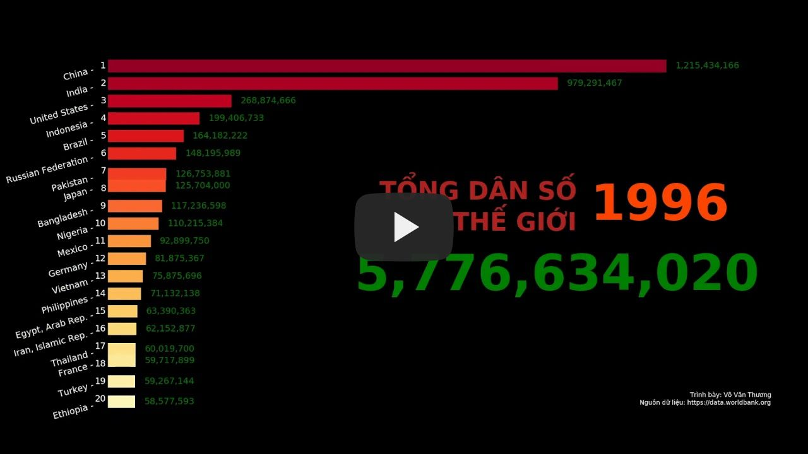

# TOP 20 QUỐC GIA CÓ DÂN SỐ LỚN NHẤT THẾ GIỚI 1961 - 2018

Video trình bày sự thay đổi của TOP 20 quốc gia có dân số lớn nhất thế giới từ 1961 - 2018.  
Dữ liệu được lấy từ và xử lý bằng thư viện Pandas, các biểu đồ được dựng bằng Matplotlib và kết nối thành video bằng OpenCV.  
Nguồn dữ liệu: [https://data.worldbank.org](https://data.worldbank.org)
  
  
